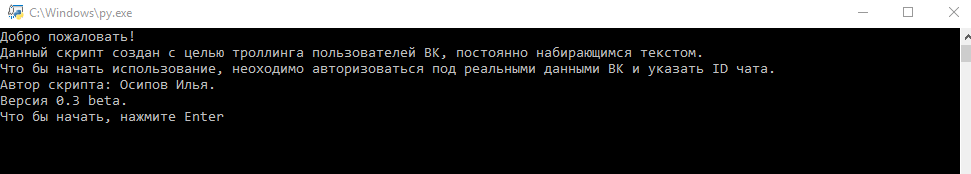
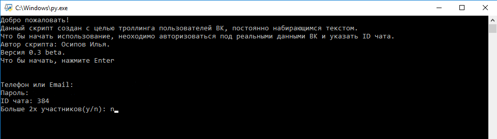
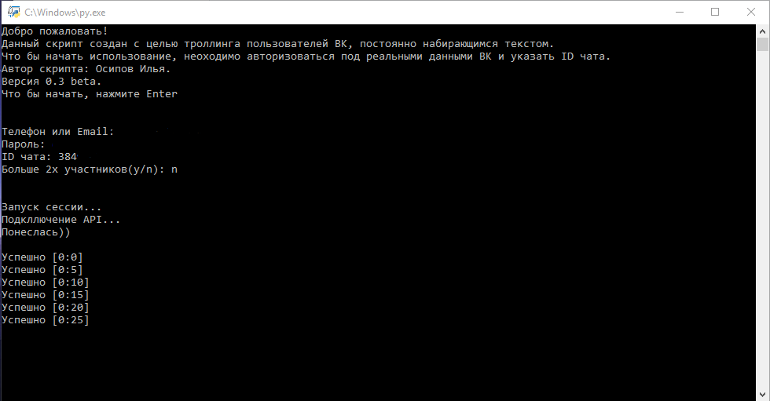

# VKTroll
Постоянный набор сообщения в диалогах ВК.

Программа выводит текст "<Имя> печатает" в диалогах и беседах ВК.

## Инструкция
При запуске программы выводится приветственное сообщение с описанием работы и версией.

Что бы начать работу нажимаем Enter...

Вводим свой логин и пароль от vk.com, указываем id беседы, и указываем количество участников.

После ввода данных, вы увидете следующее:

Поздравляю, программа запущена и работает.
Справа от надписи успешно, вы можете видеть время работы программы [Мин:Сек]

## Откуда брать id беседы?

Заходим в интерисующую вас беседу в браузере, нажимаем на аддресную строку и копируем последние цифры:

Если нужна id беседы с большим количеством человек, то копируем только цифры, без буквы:

